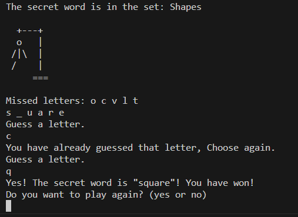

# invent-with-python
Following exercises from the invent with python textbook to strengthen and illustrate basics of python.

# Hello World
The provided Python code is a basic program that greets the user, asks for their name, and then responds with a message using the provided name. It demonstrates how to use the print function for output, input() for user input, and variables to store and manipulate the input data. This code is a simple example of user interaction and string concatenation in Python.

# Guess the Number Game
The Python code is a 'Guess the Number' game. It prompts the user for their name, generates a random number between 1 and 100, and allows the user to guess the number within ten attempts. It provides feedback on whether the guess is too high or too low. The game ends by informing the user if they guessed the number correctly and how many attempts it took. This code demonstrates the use of loops, conditionals, random number generation, and user input in Python.

# Joke telling program
The Python code presents a series of jokes using the print function to set up the joke, input() to pause the program for the user to participate, and then it delivers the punchline. This sequence of prompts and user interaction demonstrates simple conversational flow in a program using Python's input/output functions to create a joke-telling interaction.

# Dragon's Realms
In this game, the player is in a land full of dragons. The dragons all live in caves with their large piles of collected treasure. Some dragons are friendly and share their treasure. Other dragons are hungry and eat anyone who enters their cave. The player approaches two caves, one with a friendly dragon and the other with a hungry dragon, but doesn’t know which dragon is in which cave. The player must choose between the two.

The Python code is a text-based game where the player selects a cave and faces different outcomes based on their choice. It presents an introduction, prompts the player to pick a cave, and reveals whether they encounter a friendly dragon or a hostile one. The game loops, allowing the player to replay if desired. It utilizes functions, user input, randomness, and loops to create a simple interactive game scenario.

# Hangman
The Python code is a Hangman game. It randomly selects a word from different categories, and the player guesses letters to uncover the word. The game tracks missed and correct letters, displays the hangman figure as the player progresses, and determines if the player wins or loses. The code uses functions to manage various game aspects like word selection, displaying the game board, accepting player guesses, and handling game outcomes. Overall, it creates an interactive text-based game experience employing loops, conditionals, and user input in Python.

